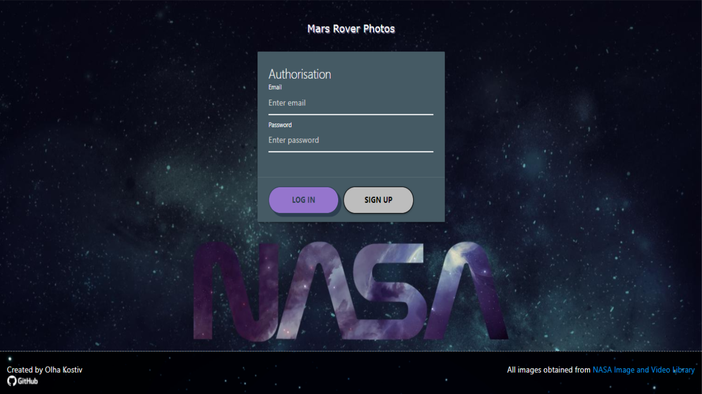
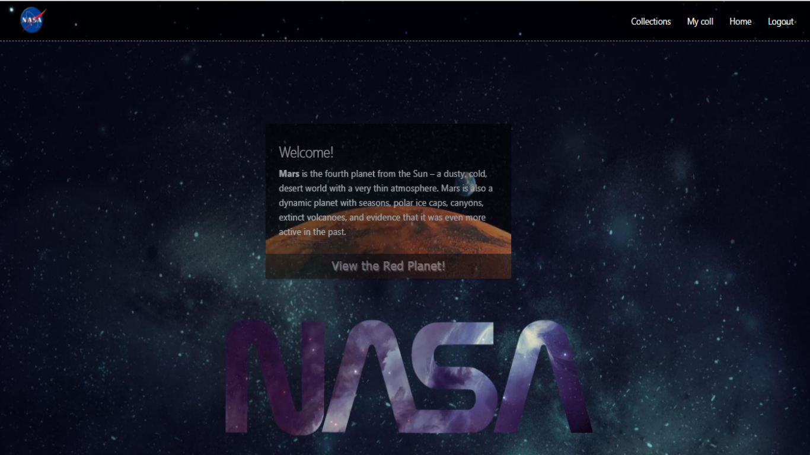
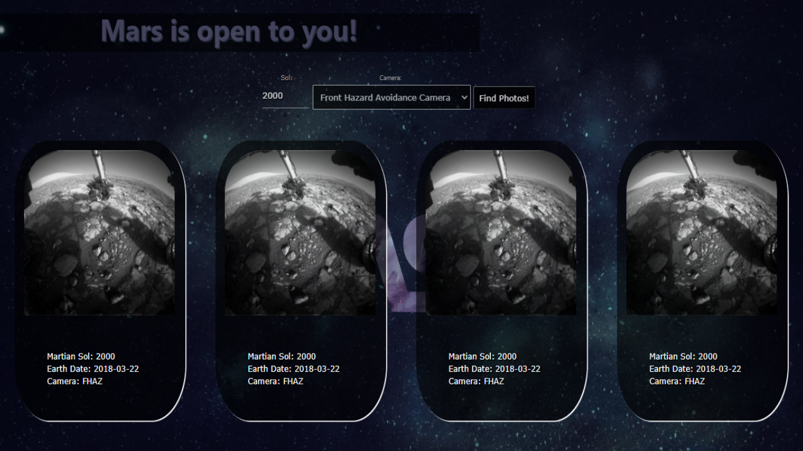

## Mars Rover Photos! 
 
Open [NASA Api](http://api.nasa.gov/) 

## Available Scripts

In the project directory, you can run:

### `npm run dev`

# Screen:

## TODO:

1. My collections
2. Pagination
3. Index files & all text in const

[LinkedIn](https://www.linkedin.com/in/olha-kostiv-84918421a/)
